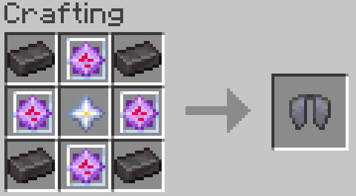
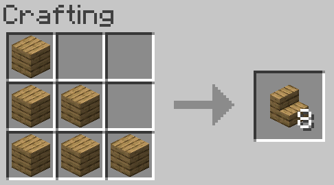
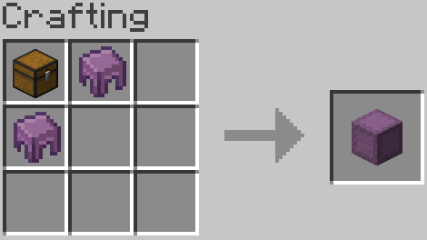

# 服务端功能与支持

## 移动与旅行

### 乐魂加速
骑上乐魂后，你会看到这样的充能条。

此时长按前进键，乐魂会开始加速，并消耗充能条。

此时等充能耗尽或急转弯，乐魂会停止加速，并开始充能。

### 大厅系统
全服任何地方执行 **/hub** 或 **/lobby** 都可以返回大厅。

## 社交与互动

### 组队系统
!!! command "party"
    _/pc 切换跨服队伍聊天_。

### 门铃
按Shift放置按钮即可获得一个门铃。

## 保护与便利

### 领地系统
[Dominion Docs（自建）](https://dominion.docs.tacs.top/notes/doc/player/){ .md-button }

### 出生点保护
出生点半径256格内有出生点保护，不可建造或破坏方块。

请使用**/rtp**传送出出生点

### 游戏内便捷计算器
简单四则运算、潜影盒转换、合成材料计算、两点间距离计算…

详见[插件页面](https://modrinth.com/project/XoHTb2Ap)

_绝对不是我不想重新写一份中文教程_

## 特殊机制与控制

### 村民脑叶切除
服务器检测到类似村民交易所的建筑会自动将范围内所有村民的AI剔除。
如果你的刷铁机较为密集或已经被服务器误判为村民交易所，请将村民命名为**"activated"**以恢复AI。

!!! warning "严禁滥用此功能"
    严禁将非刷铁机的村民命名为activated。
    如果造成大量卡顿，你将会收到封号大礼包。

### 幻翼生成控制
!!! command "pil"

## 娱乐与辅助功能

### 点歌机
!!! command "music"

### 动态光源
!!! command "dl"

## 客户端模组支持
以下模组被服务器支持，可以获得较好的使用体验：

*   Jade
*   Appleskin
*   AsteorBar
*   Distant Horzion
*   Xaero's World Map
*   Xaero's Minimap
*   VoxelMap
*   Syncmatica
*   Do a Barrel Roll

!!! tips "Distant Horzion 遥远的地平线"
    Distant Horzion 只在世界预加载范围内提供服务端支持

    超出预加载范围只能由客户端渲染

## 附魔

详见[NeoEnchant+ Wiki（自建）](../neoenchants/enchantment/)

<!-- ### 最大等级提升

| Enchantment |  New Max Level | Detail |
| --- | --- | --- |
| **Aqua Affinity** | 5 | Allows you to breathe longer underwater |
| **Bane of Arthropods** | 10 | Increases damage against arthropods |
| **Blast Protection** | 7 | Reduces damage from explosions |
| **Breach** | 5 | Reduce armor effectiveness |
| **Channeling** | 5 | Summons lightning at the target |
| **Density** | 5 | Increases the smash attack per block with mace |
| **Depth Strider** | 3 | Increases underwater movement speed |
| **Efficiency** | 10 | Increases mining speed |
| **Feather Falling** | 10 | Reduces fall damage |
| **Fire Aspect** | 4 | The time of ignite is increased |
| **Fire Protection** | 7 | Reduces damage from fire |
| **Flame** | 5 | The time of ignite is increased |
| **Fortune** | 5 | Increases block drops |
| **Frost Walker** | 8 | Freezes water |
| **Impaling** | 10 | Increases damage against sea creatures |
| **Knockback** | 10 | Increases knockback |
| **Looting** | 5 | Increases mob drops |
| **Loyalty** | 8 | Increases trident return speed |
| **Luck of the Sea** | 5 | Increases fishing luck |
| **Lure** | 5 | Increases fishing speed |
| **Mending** | 5 | The repairs is increased for each level |
| **Multishot** | 3 | Shoot more arrows at once |
| **Piercing** | 10 | Arrows can pierce through multiple entities |
| **Power** | 7 | Increases bow damage |
| **Projectile Protection** | 7 | Reduces damage from projectiles |
| **Protection** | 5 | Reduces all damage |
| **Punch** | 10 | Increases arrow knockback |
| **Quick Charge** | 5 | Reduces crossbow reload time |
| **Respiration** | 8 | Increases the number oxygen bubbles |
| **Riptide** | 8 | Launches the player when thrown |
| **Sharpness** | 7 | Increases melee damage |
| **Smite** | 10 | Increases damage against undead |
| **Soul Speed** | 7 | Increases movement speed on soul sand |
| **Sweeping Edge** | 10 | Increases sweep attack damage |
| **Swift Sneak** | 7 | Increases sneaking speed |
| **Thorns** | 4 | Damages attackers |
| **Unbreaking** | 10 | Increases item durability |
| **Wind Burst** | 5 | Increases the wind charge knockback |

/// caption
提升后的最大等级（未翻译）
/// -->

## 数据包
服务器数据包列表：

*   [file/Amplified_Nether_1.21_v1.2.11.zip (world)]
*   [file/BeyondEnchant-1.21.2.zip (world)]
*   [file/BlazeandCave's_Advancements_Pack_1.19.1.zip (world)]
*   [file/BlazeandCave's_Advancements_Pack_Amplified_Nether.zip (world)]
*   [file/BlazeandCave's_Advancements_Pack_Nullscape.zip (world)]
*   [file/BlazeandCave's_Advancements_Pack_Terralith.zip (world)]
*   [file/Continents_1.21_v1.1.10.zip (world)]
*   [file/Hearths_v1.0.4_f12-80.dp.zip (world)]
*   [file/NeoEnchant-V5.12.1-for-1.21.6-to-1.21.8-fixed-TACS.zip (world)]
*   [file/NeoEnchantAddon-Structure-V1.1.0-for-1.21.6.zip (world)]
*   [file/Nullscape_1.21_v1.2.13.zip (world)]
*   [file/Structory_1.21_v1.3.11.zip (world)]
*   [file/Structory_Towers_1.21_v1.0.13.zip (world)]
*   [file/Terralith_1.21.5_v2.5.11.zip (world)]
*   [file/VanillaTweaks_TACS_MC1.21-1.21.8.zip (world)]
*   [file/hopobettermineshaft-1-21-6-1-3-2-zh-cn.zip (world)]
*   [file/hopobetterruinedportals-1-21-6-1-4-7-zh-cn.zip (world)]
*   [file/hopobetterunderwaterruins-1-21-6-1-2-4-zh-cn.zip (world)]
*   [file/qraftyfied_-_INDUSTRIAL.zip (world)]
*   [file/terratonic-3.0.0-datapack.zip (world)]
*   [file/v10qraftyfied_-_TERRALITH.zip (world)]

如果有人想了解其中内容，可以自行搜索。
## 合成表

- 
- 
> 鞘翅复制
> 合成后会单独返回第二个鞘翅
- 
- 
- 
- 

