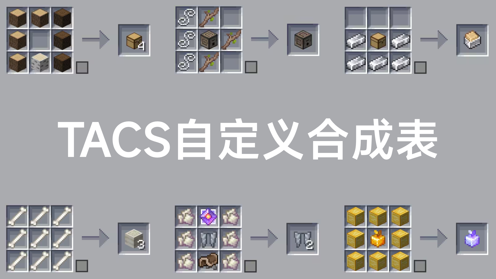

> 由于很多新玩家不会或不知道服务器内各项功能如何使用, 故撰写该部分
## MCDR指令
- !s |
可以切换生存模式和旁观者模式
切换回生存模式时, 位置和切换之前一样, 不会改变
- !!spec |
!s的别名
- !!bot |
假人管理器
[使用文档](https://mcdreforged.com/zh-CN/plugin/bot)
- !!pb |
[Prime Backup](https://mcdreforged.com/zh-CN/plugin/prime_backup)备份插件的指令
使用方法请查看[Prime Backup 文档](https://tisunion.github.io/PrimeBackup/zh/command/)
- !!wp !!here !!vris |
[Where2go](https://mcdreforged.com/zh-CN/plugin/where2go)位置插件的指令
使用方法请查看[Where2go 文档](https://mcdreforged.com/zh-CN/plugin/where2go/readme)
- @ someone |
艾特某个人
- @@ someone |
强力艾特某个人
- !!here |
发送自己的位置
- !!calc |
提供游戏内多种便捷计算

您可以使用 ``=<expression>`` 直接计算表达式，或使用 ``==<count/expression>`` 将物品数转换堆叠数。

| 指令 | 用途 | 示例 | 结果 |
| - | - | - | - |
| !!calc ``<expression>`` | 计算表达式 | !!calc 1+1 | 1+1=2 |
| !!calc item ``<count/expression>`` | 物品数转换堆叠数 | !!calc item 1794 | 1794个物品为1盒2组3个 |
| !!calc item ``<box>`` ``<stack>`` ``<single>`` | 堆叠数转换物品数 | !!calc item 1 10 32 | 1盒10组32个为2400个物品 |
| !!calc color ``<red>`` ``<green>`` ``<blue>`` | 10进制RGB转16进制 | !!calc color 255 0 255 | (255, 0, 255) -> #FF00FF |
| !!calc color ``<#HEX>`` | 16十进制RGB转10进制 | !!calc color #00FF00 | #00FF00 -> (0, 255, 0) |

## 原版指令
- /seed |
获取服务器种子
- /lg i |
[Ledger](https://modrinth.com/mod/ledger)查熊模组的指令
使用方法请查看[Ledger 文档](https://www.quiltservertools.net/Ledger/latest/)

## 假人管理
常用机器的假人请保存到假人管理器中, 并带上中文注释

**假人名称需遵守[假人命名规范](../fakeplayer.md)**
!!! note "不要使用奇奇怪怪的缩写"
    比如``bot_zrt``(猪肉塔) ``bot_hht``(海货塔)
    **~~很容易挨揍~~**
## 成就汉化
客户端装载[成就汉化材质包](https://modrinth.com/resourcepack/bacap-language-pack)后即可获得中文成就翻译

/// caption
自定义合成表
///

/// caption
头颅获取方式
///